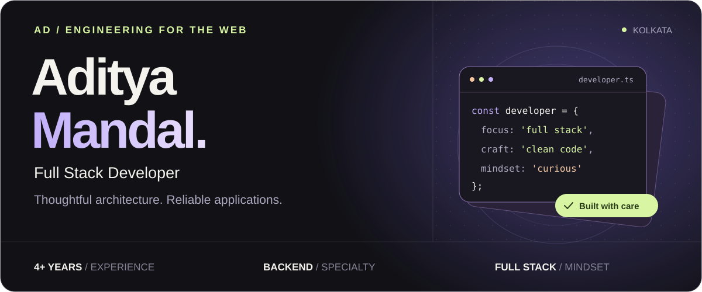
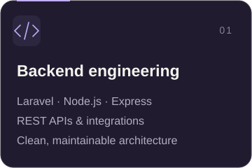
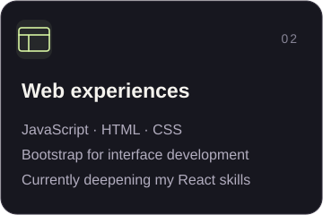
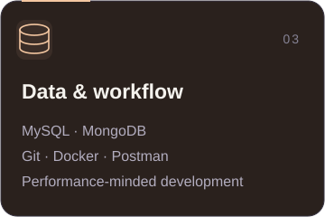
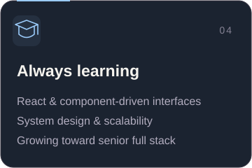

  

  
  
  

 

01 &nbsp; / &nbsp; THE DEVELOPER

<h2 align="center">Behind the code</h2>

  I'm <strong>Aditya</strong>, a full stack developer based in <strong>Kolkata, India</strong>. 
  I turn complex requirements into straightforward web applications, 
  with <strong>Laravel, Node.js, and REST APIs</strong> at the heart of my work.

  Clear architecture. Maintainable code. Performance that matters.

 

02 &nbsp; / &nbsp; FOCUS &amp; CRAFT

<h2 align="center">From the backend to the browser</h2>

  
  
  
  

 

03 &nbsp; / &nbsp; THE TOOLKIT

<h2 align="center">Tools I build with</h2>

<strong>Backend &amp; data</strong>

  

<strong>Frontend &amp; workflow</strong>

  

 

04 &nbsp; / &nbsp; BUILDING IN PUBLIC

<h2 align="center">Code in motion</h2>

<table width="100%">
  <tr>
    <td>
      <h3>My contribution calendar</h3>
      
A little progress, one commit at a time.

      
      
<a href="https://github.com/AdityaMandalDev?tab=overview">Explore activity on GitHub ↗</a>

    </td>
  </tr>
</table>

  
<strong>A different view of my contributions</strong> &nbsp; · &nbsp; Watch the animation

   
  <picture>
    <source media="(prefers-color-scheme: dark)" srcset="https://raw.githubusercontent.com/AdityaMandalDev/AdityaMandalDev/output/github-contribution-grid-snake-dark.svg" />
    <source media="(prefers-color-scheme: light)" srcset="https://raw.githubusercontent.com/AdityaMandalDev/AdityaMandalDev/output/github-contribution-grid-snake.svg" />
    
  </picture>

 
 

  <a href="https://www.linkedin.com/in/aditya-mandal">LinkedIn</a> &nbsp; / &nbsp;
  <a href="https://leetcode.com/u/adityamandal8617/">LeetCode</a> &nbsp; / &nbsp;
  <a href="https://www.hackerrank.com/profile/adityamandal">HackerRank</a>

Crafted with curiosity, from Kolkata.

